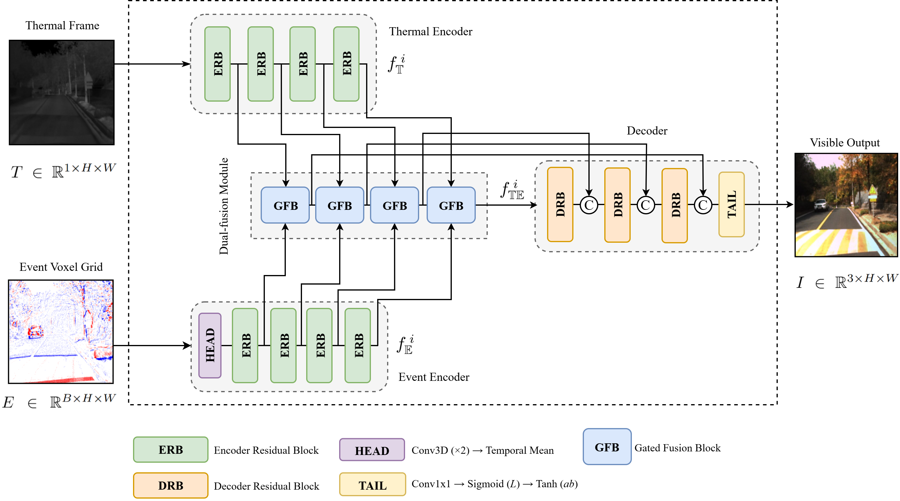

# Fusing Thermal and Event Data for Visible Spectrum Image Reconstruction

[](https://visapp.scitevents.org/)

**Authors:** Simone Melcarne and Jean-Luc Dugelay

*Eurecom Research Center, Digital Security Department, Biot, France*

---

<p align="center">
  
</p>

## Publication
This paper has been accepted for publication at the **21st International Conference on Computer Vision Theory and Applications (VISAPP 2026)**.

---

## Abstract
Reconstructing visible spectrum images from unconventional sensors is a timely and relevant problem in computer vision. In settings where standard cameras fail or are not allowed, thermal and event-based cameras can offer complementary advantages—robustness to darkness, fog, motion, and high dynamic range conditions—while also being privacy-preserving and energy efficient.

We propose a simple **dual-encoder, gated-fusion network** that synthesizes visible-like images from thermal frames and event streams. The thermal branch captures structure and coarse appearance, while the event branch models spatio-temporal changes and adds detailed edge information. Their outputs are combined via a residual gated fusion mechanism and decoded into a colored image.

## The Framework

<p align="center">
  
</p>

Our method leverages the complementary nature of two modalities to reconstruct a standard RGB-like image ($I \in \mathbb{R}^{3 \times H \times W}$):

1.  **Thermal Input ($T$):** Provides semantic layout and object presence (processed by a ResNet-style encoder).
2.  **Event Input ($E$):** A voxel grid of events that offers sharp edge and motion cues (processed by a 3D-Conv head + ResNet encoder).

### Key Components:
* **Dual-Fusion Module:** Features from both encoders are fused at multiple resolutions using a **Gated Fusion Block (GFB)**. This allows the network to selectively inject event details into the thermal baseline:
    $$f_{TE}^{(i)} = f_T^{(i)} + \alpha_i \cdot f_E^{(i)}$$
* **Color Space:** The network predicts in the **Lab color space** to better separate luminance and chrominance.
* **Loss Function:** We train end-to-end using a combination of Spatial L1 ($L_{s-l_1}$), Multi-Scale SSIM ($L_{MS-SSIM}$), and Color L1 ($L_{ab-l_1}$) losses.


## Dataset Preparation

To reproduce our results, you need to set up the dataset following the structure below. Our framework relies on the **KAIST Multispectral Benchmark** (for Thermal/RGB) and pre-processed **Event Voxel Grids** (simulated via V2E).

### 1. Download Data
1.  **KAIST-MS Dataset (Thermal & RGB):**
    Download the official dataset from the [KAIST Project Page](https://sites.google.com/site/pedestriandataset/).
    * You need the `lwir` (Thermal) and `visible` (RGB) folders for the day sets (`set01`, `set02`, `set06`, `set07`, `set08`).
2.  **Event Data (Voxel Grids):**
    Since we use simulated events aligned with KAIST frames, you must download our pre-processed voxel grids (`.npy` files).
    * 📥 **[DOWNLOAD LINK HERE]** (e.g., Google Drive / Zenodo / OneDrive)
    * *Note: These events were generated using the [V2E Simulator](https://github.com/SensorsINI/v2e). Settings are reported in the paper.*

### 2. Folder Structure
Organize your data directory (e.g., `./data`) to match the hierarchy expected by the dataloader. The structure must preserve the `setXX/VideoXX` organization.

```text
/path/to/your/data/
│
├── kaist-rgbt/                # Original KAIST Dataset
│   ├── set01/
│   │   ├── V000/
│   │   │   ├── lwir/          # Contains I00000.jpg, etc.
│   │   │   └── visible/       # Contains I00000.jpg, etc.
│   │   └── ...
│   ├── set02/
│   └── ...
│
└── voxel_grid_soft_rgb/       # Our Pre-processed Event Data
    ├── set01/
    │   ├── V000/
    │   │   ├── set01_V000_00000.npy
    │   │   └── ...
    │   └── ...
    ├── set02/
    └── ...

## Usage

```bash
# Clone the repository
git clone [https://github.com/yourusername/thermal-event-fusion.git](https://github.com/yourusername/thermal-event-fusion.git)

# Install dependencies
pip install -r requirements.txt

# Run inference on a sample
python test.py --thermal input/thermal.png --events input/events.npz --output result.png
```

## Citation

If you find this work useful for your research, please cite our paper:

```bibtex
@inproceedings{melcarne2026fusing,
  title={Fusing Thermal and Event Data for Visible Spectrum Image Reconstruction},
  author={Melcarne, Simone and Dugelay, Jean-Luc},
  booktitle={Proceedings of the 21st International Conference on Computer Vision Theory and Applications (VISAPP)},
  year={2026},
  organization={SciTePress}
}
